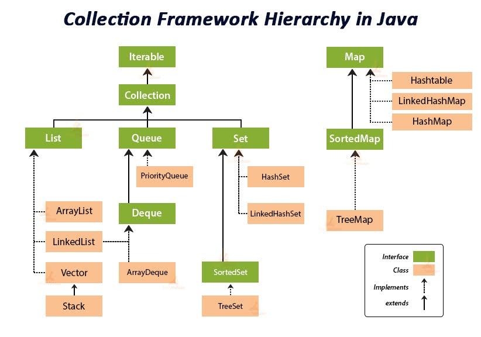

Problema:

Given an array of strings strs, group the anagrams together. You can return the answer in any order.

 

Example 1:

Input: strs = ["eat","tea","tan","ate","nat","bat"]

Output: [["bat"],["nat","tan"],["ate","eat","tea"]]

Explanation:

There is no string in strs that can be rearranged to form "bat".
The strings "nat" and "tan" are anagrams as they can be rearranged to form each other.
The strings "ate", "eat", and "tea" are anagrams as they can be rearranged to form each other.
Example 2:

Input: strs = [""]

Output: [[""]]

Example 3:

Input: strs = ["a"]

Output: [["a"]]

Constraints:

1 <= strs.length <= 104
0 <= strs[i].length <= 100
strs[i] consists of lowercase English letters.

Solução:

Oque deve ser desenvolvido e qual o objetivo?
- O objetivo é agrupar strings que são anagramas umas das outras em subarrays dentro de um array maior.
Qual a saída:
- A saída é um array de arrays, onde cada subarray contém strings que são anagram
Qual a entrada:
- A entrada é um array de strings.
Exemplos:
  - Exemplo 1:
    - Entrada: ["eat","tea","tan","ate","nat","bat"]
    - Saída: [["bat"],["nat","tan"],["ate","eat","tea"]]
  - Exemplo 2:
    - Entrada: [""]
    - Saída: [[""]]
  - Exemplo 3:
    - Entrada: ["a"]
    - Saída: [["a"]]
Quais restrições existem:
- O array de entrada pode ter até 10.000 strings.
- Cada string pode ter até 100 caracteres.
- As strings consistem apenas em letras minúsculas do alfabeto inglês.
Observações relevantes:
- A ordem dos grupos de anagramas na saída não importa.
Estratégia para resolver o problema:
- Utilizar um HashMap para mapear uma representação canônica de cada grupo de anagramas para uma lista de strings que pertencem a esse grupo.
- A utiliação do framework collections é essencial para facilitar a manipulação dos dados.

Passo a passo que defini:
1. Criei 3 metodos principais: groupAnagrams, constitution e generateStringCode.
   - constitution: Cria uma representação canônica (string code) para cada string baseada na contagem de caracteres.
   - generateStringCode: Gera uma string única que representa a contagem de cada caractere na string. na ordem do alfabeto.
  - groupAnagrams: Agrupa as strings em anagramas usando um HashMap.

  